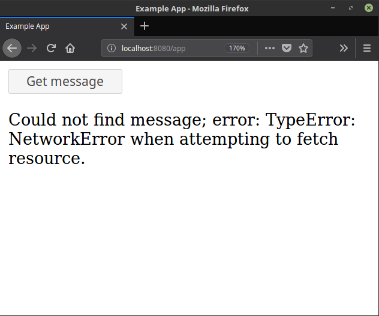
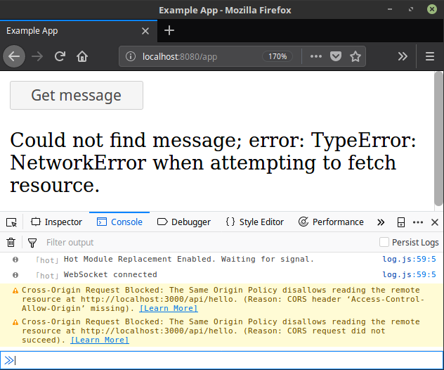
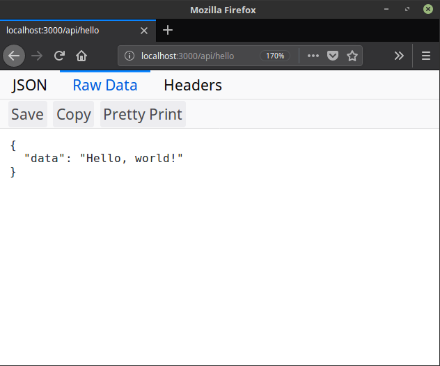

:data-transition-duration: 0
:skip-help: true
:css: style.css
:title: React App Orchestration

.. role:: strike
    :class: strike

----

:id: title-slide

Orchestrating React apps and back-ends in a development environment
===================================================================

David Roeca
~~~~~~~~~~~
Senior Software Engineer
~~~~~~~~~~~~~~~~~~~~~~~~

Kepler Group
~~~~~~~~~~~~

.. note::
    * Introduce self & work
    * Making apps and back-ends play nicely together

----

:id: throughline

Development Environment as Code
===============================

.. note::
    * Why am I here? I'm here to talk about your development environment.
    * DevOps "Infrastructure as code" comparison
    * Core mantra: if you can, move it from the README to a config file
      (hopefully it was at least in the readme...)
    * You might use different tools, but the mantra should hold

----

:id: story

Real-World Example
==================

.. note::
    * Collaborating with friend working on web api and I'm writing a web app
    * Wanted to modularize source code of each api and app and run them
      separately

----

:id: run-api

Run the API
===========

.. code:: bash

    curl http://localhost:5000/api/hello

.. note::
    * Friend wrote a NodeJS API in express
    * I clone the source code
    * I start the api and make a request

----

:id: broken-api-1

API
===

|sad_man|

.. note::
    * It breaks
    * After running the API, you scratch your head a ton, looking to solutions
    * Bring him in to help
    * Then we spot the bug

----

:id: broken-api-2

API
===

.. code:: javascript

    router.get('/hello', (req, res) => {
      res.json({
        data: 'Hello, world!  '.trimEnd(), // BUG
      });
    });

.. note::
    * Then realize the problem is with the NodeJS version
    * You switch node versions, and start the API and it works!
    * I want you to keep this fix in mind as we continue with this talk, as
      Node versioning may not be the only issue that needs to fixed, which is
      often easily solved with node version managers such as nodenv, nvm, and n
    * What if my friend wrote his API in Go, ruby, rust, python, etc?
    * What if I needed additional system dependencies such as a database
      system?
    * I'll get back to this in a bit, but first I want to highlight some other
      issues.

----

:id: story-api

API
===

|api_hello|

.. note::
    * The API has one route at /api/hello, providing a simple message

----

:id: app-code

App Code
========

.. code:: javascript

    class App extends React.Component {

      state = {
        message: null,
        error: null,
      }

      fetchHello = () => {
        fetch('http://localhost:5000/api/hello')
          // ... handle promise chain and set state
      }

      componentDidMount() {
        this.fetchHello()
      }

      render() {
        // Display message if retrieved; show error if error
      }

    }

.. note::
    * App has some state to store message and errors
    * Has fetchHello method to fetch state
    * And when the component mounts, it calls the fetchHello method
      to display the result

----

:id: app-error

Running the App
===============

|app_error|

.. note::
    * You run the react app to see what happens

----

:id: app-cors

Running the App
===============

|app_cors|

.. note::
    * You get this CORS message
    * "Cross-Origin Request Blocked: The Same Origin Policy disallows reading
      the remote resource at http://localhost:5000/api/hello. (Reason: CORS
      header ‘Access-Control-Allow-Origin’ missing)."

----

:id: cors-sad

Man vs CORS
===========

|sad_man|

.. note::
    * Google will tell you a solution for how to install another dependency
      on the API to handle CORS, and then also enable cors in the fetch API
    * There ought to be a better way here

----

:id: proxy-idea

Proxy?
======

.. code:: javascript

    // package.json
    {
      // ...
      "proxy": {
        "/api": {
          "target": "http://localhost:5000"
        }
      },
      // ...
    }

.. note::
    * Instead of configuring CORS, I'll go over another possibility
    * create-react-app has a proxy feature that can simplify this
    * But what's actually going on?
    * Middle man

----

:id: reverse-proxy

Reverse Proxy
=============

|reverse_proxy_diagram|

.. note::
    * Definition: a proxy server that makes downstream requests to other
      servers and returns a response on behalf of the other servers
    * To the browser it's talking to localhost, when in fact its request
      is being forwarded by the reverse proxy to the docker container running
      the development server

----

:id: forward-proxy

Disambiguation
==============

|forward_proxy_diagram|

.. note::
    * In comparison to a "proxy" or "forward proxy" makes requests to
      servers on behalf of a client

----

:id: why-useful

Using a Reverse Proxy
=====================

.. code:: text

    localhost/app1 -> React App 1
    localhost/app2 -> React (or non-react) App 2
    localhost/api -> Some back-end

.. note::
    * While the cra proxy config is quite useful, it has some limitations
    * One easy setup is to mount different apps on different paths
    * This is useful when thinking about logins, since you can use same-origin
      credentials
    * Since I cannot run both apps on the same port locally, this can't really
      be achieved
    * A reverse proxy in development can also allow you to run both apps at the
      same time and have them link to one another, without development-specific
      logic

----

:id: nginx

NGINX
=====

|nginx_logo|

.. note::
    * A great, free reverse proxy program that can be easily configured.

----

:id: nginx-config

NGINX Config
============

.. code:: nginx

    http {
      server {
        listen 80;
        server_name localhost;

        location /api {
          # In development, setting a variable to proxy_pass
          # allows nginx to start with services down
          set $target "http://localhost:5000";
          proxy_pass $target;
        }

        location /app {
          set $target "http://localhost:8080";
          proxy_pass $target;
        }
      }
    }

.. note::
    * We make use of variables to allow NGINX to start with some services down
    * NGINX in this scenario is what the browser will interact with on port 80
    * NGINX forwards requests for both front-end assets and back-end queries
      to the respective applications and the browser treats it like one single
      application
    * Don't get too bogged down in details, source is online
    * Note that in the current use case, the frontend only handles requests
      made to `/app`. We need to handle this routing configuration.

----

:id: mount-app

Routing App: publicPath
=======================

.. code:: javascript

    // webpack.config.js
    const config {
      // ...
      output: {
        // ...
        publicPath: '/app/',
      },
      // ...
    };
    module.exports = config;

.. note::
    * By default, webpack-dev-server and webpack-serve route requests to /
    * In order to tell the reverse proxy where to forward requests, it makes
      sense to mount the app under a specific route
    * To do this, we need to specify the publicPath
    * I'm going over this now because create-react-app doesn't support this
      out of the box (but they're working on it!)

----

:id: dev-server-1

Configuring Webpack-Serve
=========================

.. code:: javascript

    // serve.config.js
    // ...
    const webpackConfig = require('./webpack.config');
    const publicPath = webpackConfig.output.publicPath;
    const config = {
      host: 0.0.0.0,
      port: 8080,
      devMiddleware: {
        publicPath,
      },
      // ...
    };
    module.exports = config;

.. note::
    * webpack-serve is the future of webpack's development server
      implementation, and will be incorporated into cra at some point
    * This configuration is needed to support alternative publicPaths
    * host 0.0.0.0 -> basically says try any IP address
    * port specified here should be consistent with nginx

----

:id: dev-server-2

Configuring Webpack-Serve
=========================

.. code:: javascript

    // serve.config.js
    // ...
    const path = require('path');
    const history = require('connect-history-api-fallback');
    const convert = require('koa-connect');
    const webpackConfig = require('./webpack.config');
    const publicPath = webpackConfig.output.publicPath;
    const config = {
      // ...
      add: (app, middleware, options) => {
        const historyOptions = {
          index: path.join(publicPath, 'index.html'),
        };
        app.use(convert(history(historyOptions)));
      },
    };
    module.exports = config;

.. note::
    * to mount app under another path, we need to add a history api fallback
    * won't dig into too much detail here, but we need this to handle the
      alternative index file
    * again, source is online

----

:id: dev-server-3

Configuring Webpack-Serve
=========================

.. code:: javascript

    // serve.config.js
    // ...
    const webpackConfig = require('./webpack.config');
    const publicPath = webpackConfig.output.publicPath;
    const config = {
      // ...
      hotClient: {
        port: 34341,
        host: '0.0.0.0',
        allEntries: true,
        autoConfigure: true,
        reload: false,
        hmr: true,
      },
      // ...
    };
    module.exports = config;

.. note::
    * Configure a port for the hotClient that no other app will use
    * Same host configuration as the dev server itself
    * allEntries and autoConfigure add hot module replacement to compiler
    * Page is set not to reload but hot-module-replace -> useful for react
      hot component updates
    * source code is online

----

:id: nginx-hot

NGINX Config for Hot reload
===========================

.. code:: nginx

    server {
      listen 34341;

      # Necessary configurations for the websocket server
      proxy_http_version 1.1;
      proxy_set_header Upgrade $http_upgrade;
      proxy_set_header Connection "Upgrade";

      location / {
        set $target "http://localhost:34341";
        proxy_pass $target;
      }
    }

.. note::
    * Some additional HTTP headers are needed
    * One annoying thing we need to do is ensure that the port lines up with
      the hotClient port
    * Again don't get too bogged in remembering these details, since the source
      code is online

----

:id: package-json

Wait a second...
================

.. note::
    * Let's think back to my node version conflict issues
    * We've just introduced a system dependency
    * One that's complicated
    * I'm lazy and don't want to have to set it up
    * a different version of it might break up my set up
    * Now I want to talk about package.json for a minute

----

:id: npm-install-bad-1

NPM Install
===========

.. code:: bash

    npm install <package-name>

.. note::
    * I'm developing a javascript app
    * Someone wants to install a package locally, so they type the following
      command
    * How do I feel?

----

:id: npm-install-bad-2

NPM Install
===========

.. code:: bash

    npm install <package-name>

|sad_man|

.. note::
    * When someone runs that command, this is how I feel
    * What's missing here?

----

:id: npm-install-better

NPM Install
===========

.. code:: bash

    npm install --save <dependency>
    npm install --save-dev <dev-dependency>

.. note::
    * We need to make sure the dependencies get added to package.json
    * Obvious, right? Without taking this step, we can't share our code with
      anyone else without an annoying README that might get out of date.
    * Yarn is a nice alternative that writes to package.json by default
    * But let's pause and go back to the start of this talk.
    * package.json doesn't solve for node and npm versions -- you'll have to
      mention this in a README
    * What if we need a database?
    * What if we want to run our apps through a reverse proxy on development?

----

:id: docker

Docker
======

|docker_logo|

.. code:: Dockerfile

    # node has a pre-configured docker environment based on version

    FROM node:10.9.0-alpine as base

    # ...

    # Use system package manager to install yarn

    RUN apk add --no-cache yarn

    # ...

    RUN yarn install

    # ...

.. note::
    * Not the only solution
    * Could use something like kubernetes with minikube
    * Docker to me is the simplest

----

:id: tying-it-together

Tying it all together
=====================

|compose_logo|

.. note::
    * Docker-compose can reference a number of these Dockerfiles and link
      them together in a unified way
    * It supports networking configuration to expose ports between different
      docker containers
    * Also installs nginx
    * Handles database installation and management
    * In theory if you have two back-ends that rely on two versions of a specific
      database system

----

:id: compose-file

Compose file
============

.. code:: yaml

    version: "3.6"
    services:
      nginx:
        restart: always
        build: ./nginx
        ports:
          - "80:80"
          - "34341:34341"
        # ...
      app:
        restart: always
        build:
          context: ./app
          target: development
        # ...
      api:
        # ...

.. note::
    * One file that defines how services interact
    * Think of it like package.json for your system dependencies

----

:id: updating-nginx-1

Updating NGINX
==============

.. code:: yaml

    version: "3.6"
    services:
      app:
        # Name is DNS
      api:
        # Name is DNS

.. code:: nginx

  http {

    # Resolve DNS via the docker dns server
    resolver 127.0.0.11;

    # ...

  }

.. note::
    * We can leverage docker's internal networking capabilities

----

:id: updating-nginx-2

Updating NGINX
==============

.. code:: nginx

  http {
    # ...
    server {
    # ...
      location / {
        set $target "http://app:34341";
        proxy_pass $target;
      }
    }

    server {
      # ...
      location /api {
        set $target "http://api:5000";
        proxy_pass $target;
      }

      location /app {
        set $target "http://app:8080";
        proxy_pass $target;
      }
    }
  }

.. note::
    *

----

:id: demo

Demo
====

.. note::

    * Open terminal and run app

----

:id: caveat-cra

Caveats
=======

.. note::
    * Create-React-App
    * Webpack support and webpack-serve support are coming; please contribute!
    * public url support is coming; please contribute!
    * Webpack 4 is simpler and greatly improved compared to previous versions;
      worth learning in any case
    * Developed on linux; consider running in a virtual machine; might need
      alternative tools to the ones I've presented with
    * ==> Docker should be supported on mac and windows, so hopefully it still
      works

----

:id: why

Why do any of this?
===================

.. note::
    * A reverse proxy will simplify any networking configuration you may need
      to do while developing apps. Create-react-app has a work-around, but it
      has its flaws if you want to link from one app to another app
    * Docker and docker-compose, or really any OS-level abstractions will help
      pin down system dependencies
    * Migrating dev environment setup from READMEs to config files will make
      everyone more happy

----

:id: git-info

The Source Code is Available
============================

github.com/davidroeca/web-app-orchestration-talk

.. note::
    * Send a PR or issue

----

:id: questions

Questions
=========

----

Thank You
=========

.. Images

.. https://pixabay.com/en/lonely-man-crying-alone-male-1510265/

.. |docker_logo| image:: downloads/images/dockerlogos/docker_logos_2018/PNG/vertical.png
    :height: 100px

.. |compose_logo| image:: downloads/images/compose_logo.png
    :height: 100px

.. |nginx_logo| image:: downloads/images/nginx_logo.svg
    :height: 100px

.. |webpack_logo| image:: downloads/images/webpack_logo.svg
    :height: 100px

.. |react_logo| image:: downloads/images/react_logo.svg
    :height: 100px

.. |reverse_proxy_diagram| image:: compiled/reverse_proxy.svg
    :height: 300px

.. |forward_proxy_diagram| image:: compiled/forward_proxy.svg
    :height: 300px
